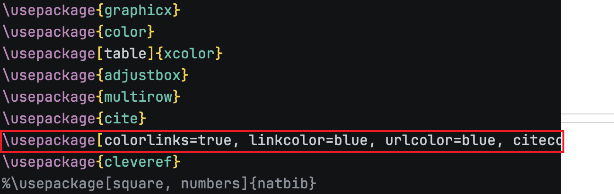
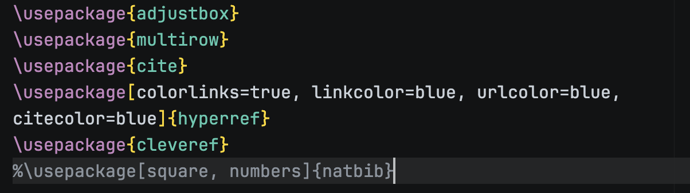

这篇文章记录一套稳定的工作流：**服务器装 LaTeX**，**Mac 用 VS Code Remote SSH 连接**，保存后由服务器编译，VS Code 里直接预览 PDF（本地不必安装完整 TeX）。

## 1.Ubuntu 上配置 LaTeX 环境

登录服务器后执行：

```bash
sudo apt update
```

### 一键部署方案

```bash
sudo apt install -y texlive-full latexmk
```

验证安装：

```bash
xelatex --version
latexmk -v
```

常用编译命令：

```bash
latexmk -xelatex main.tex
# 或（pdflatex 路线）
latexmk -pdf main.tex
```

输出清理：

```bash
latexmk -c
```

## 2. 用 VS Code 连接有 LaTeX 的服务器

### SSH 配置

编辑 `~/.ssh/config`：

```bash
Host mylatex
  HostName <服务器IP或域名>
  User <你的用户名>
  IdentityFile ~/.ssh/id_ed25519
  ServerAliveInterval 60
```

终端先确认能连上：

```bash
ssh mylatex
```

### VS Code 远程开发

1. VS Code 安装扩展：`Remote - SSH`、`LaTeX Workshop`
2. `Cmd + Shift + P` → `Remote-SSH: Connect to Host` → 选择 `mylatex`
3. 连接成功后 `Open Folder` 打开服务器上的 LaTeX 项目目录

重要：在扩展页里确认 **LaTeX Workshop 安装在远程端**（显示类似 `Installed on SSH: mylatex`），否则它调用不到服务器里的 `latexmk/xelatex`。

## 3.设置`.vscode/settings.json`--重要

在 LaTeX 项目目录新建 `.vscode/settings.json`：

```json
{
  "files.autoSave": "afterDelay",
  "files.autoSaveDelay": 1000,

  "latex-workshop.latex.autoBuild.run": "onSave",
  "latex-workshop.latex.outDir": "%DIR%/out",
  "latex-workshop.view.pdf.viewer": "tab",

  "latex-workshop.latex.recipes": [
    { "name": "latexmk (xelatex)", "tools": ["latexmk_xelatex"] }
  ],
  "latex-workshop.latex.tools": [
    {
      "name": "latexmk_xelatex",
      "command": "latexmk",
      "args": [
        "-xelatex",
        "-synctex=1",
        "-interaction=nonstopmode",
        "-file-line-error",
        "-outdir=%OUTDIR%",
        "%DOC%"
      ]
    }
  ],

  "[latex]": {
    "editor.wordWrap": "bounded",
    "editor.wordWrapColumn": 100,
    "editor.wrappingIndent": "same"
  }
}
```

如果你要用 `pdflatex`，把 `-xelatex` 改成 `-pdf`，并把 recipe/tool 名称对应改掉即可。

## 一些小tips：

### `Option + Z`：一键“折行显示”

在 macOS 的 VS Code 里：

- `Option + Z` 用于切换 **Word Wrap（视觉自动折行/软换行）**





###  未来拓展多人协作怎么做

- **Git 工作流**：每个人开分支 → 提 PR → Review/合并；把 `out/` 等构建产物加入 `.gitignore`
- **CI 自动编译**：加一个 GitHub Actions，在 PR/Push 时编译并上传 PDF artifact，减少环境差异
- **版本与依赖**：尽量固定 TeX Live 版本（或用 Dev Container / Docker 统一环境），避免宏包版本漂移
