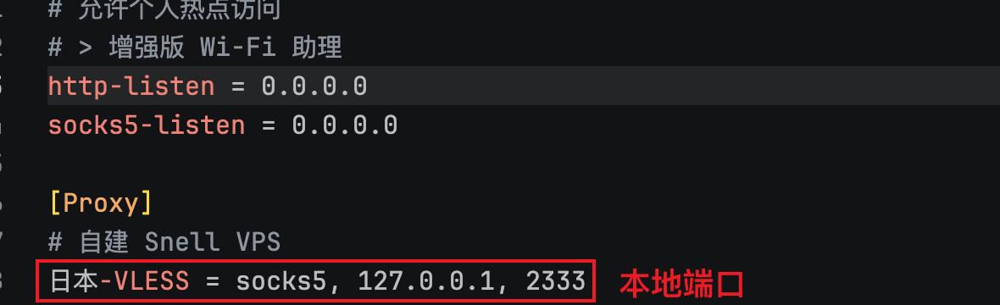
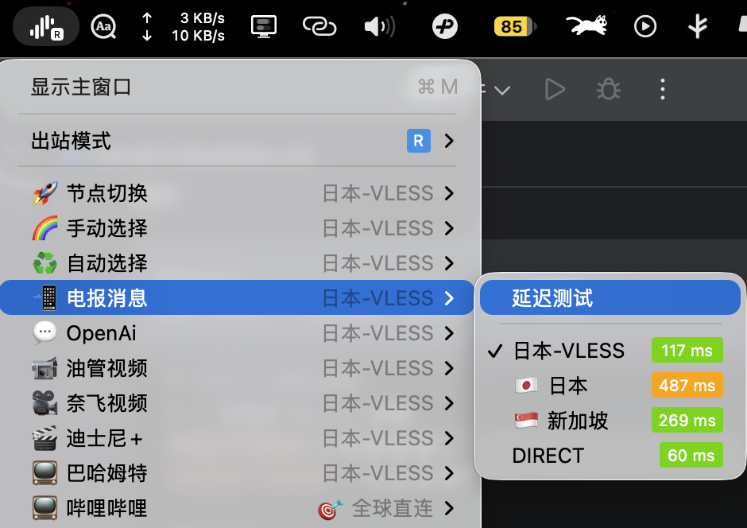

# 在 macOS 上用 Surge 分流、用 sing-box 作为 VLESS + Reality 出口

## 背景

我原本一直在 macOS 上用 Surge 作为主代理工具，负责规则、策略组和日常分流。

问题是：Surge 本身不支持 `VLESS + Reality`，而我自建 VPS 的节点协议正好就是这一套，另外一个原因主要是我一直用的 snell 协议最进感觉不太稳定了，所以想换个更稳定的协议。

这时比较稳妥的做法不是放弃 Surge，而是把职责拆开：

- `Surge` 继续负责分流、策略组、规则集
- `sing-box` 负责连接 `VLESS + Reality` 节点
- `Surge` 把需要代理的流量转发给本机 `sing-box`

这样做的好处很直接：

- 不需要重建整套分流规则
- 保留 Surge 已有的规则集、策略组和体验
- 可以把 Surge 不支持的协议交给 sing-box 处理
- 出问题时更容易定位，到底是规则问题还是节点问题

---

## 最终架构

整个链路可以理解成下面这样：

```text
应用流量
  -> Surge
  -> 命中代理规则
  -> 转发到本机 127.0.0.1:2333
  -> sing-box
  -> VLESS + Reality 节点
  -> 目标网站
```

也就是说：

- `Surge` 是前端调度器
- `sing-box` 是真正的出站客户端
- 两者之间通过本地 `SOCKS5` 连接

---

## 环境说明

本文示例环境：

- 系统：`macOS`
- 分流工具：`Surge`
- 出站工具：`sing-box`
- 节点协议：`VLESS + Reality`
- 本地监听端口：`127.0.0.1:2333`

我本机实际使用的是 `sing-box 1.13.7`，本文配置写法也按这一版本整理。

---

## 第一步：准备 VLESS + Reality 节点信息

假设你手上的分享链接类似这样：

```text
vless://UUID@your-server-ip:31614?type=tcp&encryption=none&security=reality&pbk=YOUR_PUBLIC_KEY&fp=chrome&sni=www.apple.com&sid=YOUR_SHORT_ID&spx=%2F#your-node-name
```

这类链接里，和 `sing-box` 配置最相关的字段一般是：

- `UUID`
- 服务器地址和端口
- `security=reality`
- `pbk`，也就是 Reality 的 `public_key`
- `fp`，也就是 `utls` 指纹
- `sni`
- `sid`，也就是 `short_id`

如果是最常见的 TCP 传输，通常不需要额外写复杂传输层配置。

---

## 第二步：编写 sing-box 配置

我的思路很简单：

- 给 `sing-box` 开一个本地 `mixed` 入站
- 让 `Surge` 把需要代理的流量转发到这个本地端口
- 在 `outbounds` 里配置一个 `vless + reality`
- 默认把所有进入 `sing-box` 的流量都走这个 VLESS 节点

完整示例：

```json
{
  "log": {
    "level": "info"
  },
  "inbounds": [
    {
      "type": "mixed",
      "tag": "mixed-in",
      "listen": "127.0.0.1",
      "listen_port": 2333
    }
  ],
  "outbounds": [
    {
      "type": "vless",
      "tag": "japan-vless-reality",
      "server": "your-server-ip",
      "server_port": 31614,
      "uuid": "YOUR-UUID",
      "packet_encoding": "xudp",
      "tls": {
        "enabled": true,
        "server_name": "www.apple.com",
        "utls": {
          "enabled": true,
          "fingerprint": "chrome"
        },
        "reality": {
          "enabled": true,
          "public_key": "YOUR_PUBLIC_KEY",
          "short_id": "YOUR_SHORT_ID"
        }
      }
    },
    {
      "type": "direct",
      "tag": "direct"
    },
    {
      "type": "block",
      "tag": "block"
    }
  ],
  "route": {
    "auto_detect_interface": true,
    "final": "japan-vless-reality"
  }
}
```

### 字段说明

- `type: mixed`
  这个入站同时支持 HTTP 和 SOCKS，兼容性比较省心。Surge 这边我实际按 `SOCKS5` 去连。

- `listen: 127.0.0.1`
  只监听本地回环地址，不暴露到局域网。

- `listen_port: 2333`
  这是本机给 Surge 用的入口端口。你可以自定义，但后面 Surge 配置里要保持一致。

- `type: vless`
  指定出站协议为 `VLESS`。

- `packet_encoding: xudp`
  当前很多 VLESS 场景会这样写，兼容性通常没问题。

- `server_name`
  对应分享链接里的 `sni`。

- `utls.fingerprint`
  对应分享链接里的 `fp`，常见值有 `chrome`、`firefox`、`safari`。

- `reality.public_key`
  对应分享链接里的 `pbk`。

- `reality.short_id`
  对应分享链接里的 `sid`。

- `route.final`
  表示进入 `sing-box` 的流量默认走哪个出站。因为这里 `sing-box` 只是 Surge 的出口，所以直接全部走 `japan-vless-reality` 就行。

---

## 第三步：先单独测试 sing-box

先确认 `sing-box` 是否正常。

启动命令：

```bash
sing-box run -c "/path/to/sing-box-vless-reality.json"
```

如果你配置没问题，通常会看到类似日志：

```text
INFO inbound/mixed[mixed-in]: tcp server started at 127.0.0.1:2333
INFO sing-box started
```

如果后续有应用流量进来，还会看到：

```text
INFO inbound/mixed[mixed-in]: inbound connection from 127.0.0.1:xxxxx
INFO inbound/mixed[mixed-in]: inbound connection to www.apple.com:80
INFO outbound/vless[japan-vless-reality]: outbound connection to www.apple.com:80
```

这几行说明了三件事：

- 本地入站已经监听成功
- 已经有客户端连到 `sing-box`
- `sing-box` 正在通过 `VLESS + Reality` 节点出站

---

## 第四步：把 sing-box 接入 Surge

这一步的核心目标是：

- `Surge` 仍然负责所有规则和分流
- 真正代理时，把流量交给本地 `sing-box`

### 1. 在 Surge 的 `[Proxy]` 中新增本地节点

例如：

```ini
[Proxy]
日本-VLESS = socks5, 127.0.0.1, 2333
```


这里的 `2333` 必须和 `sing-box` 的 `listen_port` 一致。

### 2. 在策略组中加入这个节点

比如：

```ini
[Proxy Group]
🚀 节点切换 = select, "日本-VLESS", "🇯🇵 日本", "🇸🇬 新加坡", DIRECT
💬 OpenAi = select, "日本-VLESS", "🇯🇵 日本", "🇸🇬 新加坡", DIRECT
📹 油管视频 = select, "日本-VLESS", "🇯🇵 日本", "🇸🇬 新加坡", DIRECT
🐟 漏网之鱼 = select, "日本-VLESS", "🇯🇵 日本", "🇸🇬 新加坡", DIRECT
```



我的实际做法是，把 `日本-VLESS` 插入常用代理策略组里，这样可以在 Surge 面板中按组切换。

### 3. 一定要加防回环规则

这是很多人第一次接这种架构时最容易漏掉的一点。

如果 `sing-box` 要连的 VPS 本身也被 Surge 代理了，就会出现回环：

```text
Surge -> sing-box -> VPS
   ^                |
   |________________|
```

解决方法是在 `[Rule]` 最前面加一条服务器直连：

```ini
[Rule]
IP-CIDR,your-server-ip/32,DIRECT,no-resolve
```

如果你有多个节点服务器，就把每个服务器 IP 都单独加一条 `DIRECT`。

---

## 第五步：验证 Surge 和 sing-box 是否真正串起来

接好以后，可以从两个方向验证。

### 方法 1：看 sing-box 日志

如果 Surge 已经把流量转发给 `sing-box`，你会看到类似：

```text
inbound/mixed[mixed-in]: inbound connection from 127.0.0.1:xxxxx
outbound/vless[japan-vless-reality]: outbound connection to example.com:443
```

这说明：

- 流量来源是本机 `127.0.0.1`
- Surge 确实把请求交给了 `sing-box`
- `sing-box` 确实在走你的 Reality 节点出站

### 方法 2：在 Surge 面板里切换策略组

把某个策略组切到 `日本-VLESS`，然后访问对应网站。

如果切回 `DIRECT` 后失效，切到 `日本-VLESS` 后恢复，说明链路已经工作正常。

---

## 第六步：把 sing-box 配成开机自启

我在 macOS 上的做法是用 `launchd`，这是最稳的方案。

先准备一个 `plist`，例如：

```xml
<?xml version="1.0" encoding="UTF-8"?>
<!DOCTYPE plist PUBLIC "-//Apple//DTD PLIST 1.0//EN" "http://www.apple.com/DTDs/PropertyList-1.0.dtd">
<plist version="1.0">
<dict>
  <key>Label</key>
  <string>com.example.sing-box</string>

  <key>ProgramArguments</key>
  <array>
    <string>/opt/homebrew/bin/sing-box</string>
    <string>run</string>
    <string>-c</string>
    <string>/path/to/sing-box-vless-reality.json</string>
  </array>

  <key>RunAtLoad</key>
  <true/>

  <key>KeepAlive</key>
  <true/>

  <key>StandardOutPath</key>
  <string>/path/to/sing-box.stdout.log</string>

  <key>StandardErrorPath</key>
  <string>/path/to/sing-box.stderr.log</string>
</dict>
</plist>
```

把它放到：

```text
~/Library/LaunchAgents/com.example.sing-box.plist
```

然后执行：

```bash
launchctl bootstrap gui/$(id -u) ~/Library/LaunchAgents/com.example.sing-box.plist
launchctl enable gui/$(id -u)/com.example.sing-box
```

查看状态：

```bash
launchctl print gui/$(id -u)/com.example.sing-box
```

如果看到：

```text
state = running
pid = ...
last exit code = 0
```

基本就说明运行正常了。

## 如何查看 sing-box 运行状态和日志

### 1. 查看服务状态

```bash
launchctl print gui/$(id -u)/com.example.sing-box
```

重点看：

- `state = running`
- `pid = ...`
- `last exit code = 0`

### 2. 查看日志

```bash
tail -f /path/to/sing-box.stdout.log
tail -f /path/to/sing-box.stderr.log
```

几个常见日志含义：

- `tcp server started at 127.0.0.1:2333`
  本地监听成功

- `inbound connection from 127.0.0.1:xxxxx`
  Surge 已经把流量交给了 `sing-box`

- `outbound/vless[...]`
  正在通过 VLESS 节点出站

- `bind: address already in use`
  本地端口被占用

- `i/o timeout`
  连远端服务器超时

- `tls`、`reality`、`handshake` 相关错误
  多半是节点参数、SNI、短 ID、公钥或网络链路有问题

---

## 如何关闭服务

如果是 `launchd` 管理的 `sing-box`，可以这样停止：

```bash
launchctl bootout gui/$(id -u) ~/Library/LaunchAgents/com.example.sing-box.plist
```

重新启动：

```bash
launchctl bootstrap gui/$(id -u) ~/Library/LaunchAgents/com.example.sing-box.plist
```

禁用开机自启：

```bash
launchctl disable gui/$(id -u)/com.example.sing-box
```

---

## 这套方案的优缺点

### 优点

- 继续使用 Surge 的分流体验
- 兼容 Surge 暂不支持的 `VLESS + Reality`
- 配置职责清晰，排障方便
- 可以逐步替换出口，而不用重写全部规则

### 缺点

- 多了一层本地转发，结构更复杂
- 需要额外维护 `sing-box`
- 如果本地监听端口改了，Surge 也要同步修改
- 如果忘了写服务器 IP 的直连规则，容易出现回环

---

## 结论

如果你已经深度使用 Surge 的规则体系，但出口节点协议又是 Surge 不支持的 `VLESS + Reality`，那么：

`Surge 做分流，sing-box 做出口` 是一套非常实用、稳定且容易维护的组合。

简单总结就是：

- `Surge` 不负责连 Reality
- `sing-box` 不负责复杂分流
- 两者各做自己最擅长的事

这套组合跑顺以后，体验基本和原生 Surge 节点没有本质区别，但协议兼容性会高很多。

---

## 可直接复用的检查命令

最后附几条我自己常用的排查命令：

```bash
# 查看 sing-box 服务状态
launchctl print gui/$(id -u)/com.example.sing-box

# 查看本地监听端口
lsof -nP -iTCP:2333 -sTCP:LISTEN

# 实时查看日志
tail -f /path/to/sing-box.stdout.log
tail -f /path/to/sing-box.stderr.log

# 手工测试配置文件是否合法
sing-box check -c /path/to/sing-box-vless-reality.json
```

如果你也在用 Surge，但节点已经切到 `VLESS + Reality`，这套方案基本值得直接上。
